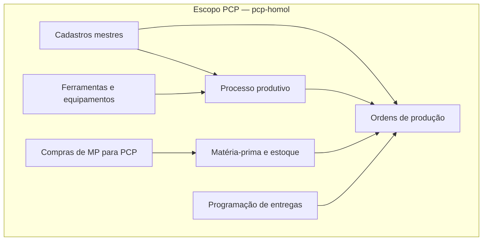

# 03 — Escopo do módulo PCP

Lista completa do que será modernizado neste projeto.

---

## Perímetro funcional

---

## Menu PRODUÇÃO (programas COBOL → sistema novo)

| Opção | Programa | Função no sistema novo |
|-------|----------|------------------------|
| 019 | PC1019 | Cadastro de grupos de produto |
| 021 | PC1018 | Cadastro de produtos |
| 088 | PC1033 | Cadastro de classe de matéria-prima |
| 091 | PC1022 | Cadastro de matéria-prima |
| 095 | PC1034 | Requisição de compras de MP |
| 100 | PC1109 | Baixa de matéria-prima |
| 102 | PC1065 | Cadastro de grupo de equipamento |
| 103 | PC1064 | Cadastro de equipamentos |
| 104 | PC1069 | Cadastro de seções |
| 105 | PC1070 | Cadastro do processo de produção |
| 106 | PC1128 | Gerenciamento de ferramentas |
| 107 | PC1028 | Cadastro de ordem de produção |
| 108 | PC1041 | Emissão de ordem de produção |
| 110 | PC1078 | Relatório de OP em aberto |
| 111 | PC1071 | Relatório de OP baixadas |
| 112 | PC1132 | Baixa de operações da OP |
| 113 | PC1073 | Cadastro NRMP |
| 114 | PC1077 | Emissão NRMP |
| 117 | PC1076 | Baixa de matéria-prima (movimento) |
| 118 | PC1094 | Almoxarifado de ferramentas |
| 119 | PC1102 | Consulta ferramentas × peças |
| 120 | PC1103 | Consulta peças × matéria-prima |
| 121 | PC1105 | Compras de MP pela programação |
| 122 | PC1106 | Cadastro de desenho do cliente |
| 128 | PC1086 | Requisição de estoque de MP |
| 133 | PC1123 | Consulta posição de compras |
| 136 | PC1135 | Consulta produção por setor |
| 137 | PC1134 | Consulta última compra de MP |
| 160 | PC1171 | Sintéticos da produção |
| 161 | PC1146 | OP pelo desenho do cliente |

**Total menu PRODUÇÃO:** 31 funções mapeadas.

---

## Menu PROGRAMAÇÃO

| Opção | Programa | Função no sistema novo |
|-------|----------|------------------------|
| 004 | PC1004 | Cadastro de clientes (referência) |
| 015 | PC1050 | Acerto / inicialização mensal |
| 021 | PC1018 | Cadastro de produtos |
| 056 | PC1066 | Entrada e baixa de programação |
| 057 | PC1067 | Listagem programação dia/mês |
| 058 | PC1068 | Consulta planejamento de entregas |
| 062 | PC1025 | Valorização do planejamento |
| 066 | PC1089 | Consulta planejamento e produção |
| 067 | PC1095 | Consulta programação dia/mês |
| 068 | PC1097 | Manutenção saldo de planejamento |
| 069 | PC1098 | Relatório posição do planejamento |
| 076 | PC1096 | Etiquetas de caçambas |
| 081 | PC1104 | Mensagens de clientes (planejamento) |
| 115 | PC1115 | Devolução de entrega planejada |
| 135 | PC1112 | Consulta produção por setor (prog.) |
| 136 | PC1135 | Consulta produção por setor |
| 138 | PC1133 | Gerador programação mensal |
| 139 | PC1133D | Gerador programação diária |
| 140 | PC1113 | Locais de entrega |
| 141 | PC1166 | Transfere data de programação |

**Total menu PROGRAMAÇÃO:** 20 funções mapeadas.

---

## Menu ALMOXARIFADO (parte PCP)

| Opção | Programa | Função |
|-------|----------|--------|
| 091 | PC1022 | Cadastro matéria-prima |
| 098 | PC1038 | Movimento entrada MP |
| 099 | PC1039 | Relatório entrada MP |
| 100 | PC1109 | Baixa MP |
| 101 | PC1059 | Relatório estoque min/max |
| 113–117 | PC1073, PC1077, PC1076, PC1085 | Lotes MP |
| 128–129 | PC1086, PC1088 | Requisição estoque MP |
| 133 | PC1123 | Posição compras |
| 159 | PC1121 | Mapa de compras |

---

## Fluxos de negócio centrais

### Fluxo A — Ciclo da Ordem de Produção

1. Cadastrar produto e processo produtivo (PC1018, PC1070)
2. Criar OP (PC1028) — produto pelo **desenho do cliente**, quantidade, tipo (PRO/PIL/TRY/PRD); copia roteiro para `PCPA28E`
3. Emitir/imprimir OP (PC1041) — lê processo + operações; gera relatório e requisição de MP
4. Baixar operações por setor (PC1132)
5. Baixar matéria-prima consumida (PC1076 / PC1109)
6. Encerrar OP — flags `OP-BAIXADA`, `OP-BAIXADA-MP`, `OP-BAIXADA-PRODUTO`

### Fluxo B — Matéria-prima

1. Cadastro (PC1022) → `PCPA22I.DAT`
2. Requisição de compra (PC1034) → `PCPA41I.DAT`
3. Entrada / NRMP (PC1073) → `PCPA73I.DAT`
4. Baixa na produção (PC1076) → `PCPA76I.DAT` + atualiza saldo em `PCPA22I.DAT`

### Fluxo C — Programação de entregas

1. Gerar programação mensal/diária (PC1133 / PC1133D) → `PCPA66I.DAT`
2. Manter saldo de planejamento (PC1097) → `PCPA68I.DAT`
3. Registrar entregas e baixas (PC1066)
4. Compras de MP pela programação (PC1105)

---

## Observação sobre login "PCP" no legado

No `PCP.COB` / `PC1000.COB`, o sistema chamado **"PCP"** com senha `7721` é um **acesso amplo** que navega por vários menus (financeiro, faturamento, etc.) usando teclas `+` e `-`.

**No projeto novo**, "PCP" significa apenas o **conjunto funcional** descrito neste documento — não replicamos o acesso administrativo a todo o ERP.
