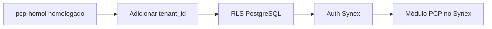

# 09 — Relação com o Synex

Por que este projeto existe separado e como ele vira parte do Synex depois.

---

## Dois produtos, uma história

| | **pcp-homol** (agora) | **Synex** (futuro) |
|---|----------------------|-------------------|
| **Objetivo** | Homologar PCP com a FANANDRI | SaaS multi-tenant comercial |
| **Clientes** | Um (FANANDRI) | Vários locatários |
| **Stack** | Node + React + PostgreSQL | Django + PostgreSQL (definido) |
| **Auth** | JWT simples (previsto) | Auth Synex + RLS |
| **Fiscal** | Fora do escopo | API parceiro |
| **Documentação** | `pcp-homol/docs/` | `synex/docs/` |

---

## Por que não começar direto no Synex?

1. **Risco menor** — Validar com um cliente real antes de generalizar
2. **Velocidade** — Piloto focado só no PCP, sem multi-tenant
3. **Aprendizado** — Você e a equipe dominam o domínio antes do SaaS
4. **Aceite claro** — Homologação FANANDRI vira case de sucesso

---

## O que transferir para o Synex

| Ativo | Como transferir |
|-------|-----------------|
| Modelo de dados | Recriar models Django espelhando Prisma validado |
| Regras de negócio | Reimplementar em Python com testes (não copiar Node) |
| Fluxos de tela | Redesenhar na stack web do Synex |
| Documentação `docs/` | Migrar conteúdo relevante para `synex/docs/modulos/pcp/` |
| Scripts de migração | Adaptar para ETL Django ou manter one-shot histórico |

---

## Adaptações obrigatórias na incorporação

| Mudança | Motivo |
|---------|--------|
| Coluna `tenant_id` em todas as tabelas | Isolamento multi-tenant |
| Row-Level Security (RLS) | Segurança no PostgreSQL |
| Remover referências hardcoded FANANDRI | Produto genérico |
| Portar stack para Django | Padrão Synex |

---

## Estratégias de incorporação (decidir depois da homologação)

| Estratégia | Prós | Contras |
|------------|------|---------|
| **Reescrever em Django** | Stack única, manutenção simples | Esforço de port |
| **Microserviço Node** | Reaproveita código homologado | Duas stacks em produção |
| **Híbrido** | Django + serviço pesado só para migração | Complexidade média |

**Recomendação atual:** reescrever em Django após homologação — o valor está nas **regras validadas**, não no código Node.

---

## Nome e identidade

- **pcp-homol** = projeto interno de homologação  
- **Synex** = marca do produto SaaS  
- O módulo incorporado pode se chamar **Synex PCP** ou **Synex Produção**
