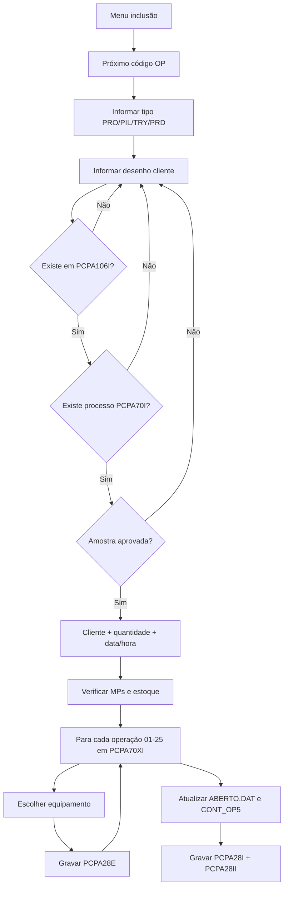

# 12 — Engenharia reversa: PC1028 e PC1041 (Ordem de Produção)

Documento gerado a partir da leitura dos fontes COBOL em `/Users/scominato/FANANDRI/FONTES/`.

**Programas analisados:**

| Programa | Menu | Função |
|----------|------|--------|
| **PC1028** | Produção 107 | Cadastro da OP (inclusão, consulta, alteração, exclusão, baixa) |
| **PC1041** | Produção 108 | Emissão/impressão da OP (relatório + requisição de MP) |

---

## 1. Arquivos envolvidos

### Gravação da OP (PC1028)

| Arquivo | Papel |
|---------|-------|
| `PCPA28I.DAT` | Cabeçalho da OP |
| `PCPA28II.DAT` | Nome do cliente (`OP-CLIENTE`) |
| `PCPA28E.DAT` | Operações da OP (equipamento, ferramenta, data encerramento) |
| `PCPA70I.DAT` | Cabeçalho do processo produtivo |
| `PCPA70XI.DAT` | Roteiro de operações do processo |
| `PCPA70C.DAT` | Complemento de MPs do processo |
| `PCPA106I.DAT` | Cadastro de desenho do cliente (`DESENHO`) |
| `PCPA22I.DAT` | Matéria-prima (consulta estoque na inclusão) |
| `ABERTO.DAT` | Últimas 5 OPs abertas por produto |
| `CONT_OP5.DAT` | Buffer circular de 5 OPs por produto (`OP5`) |
| `PCPA71I.DAT` | Baixas da OP (consulta em OP baixada) |

### Emissão (PC1041)

| Arquivo | Papel |
|---------|-------|
| Todos acima + | Lê OP, processo e `PCPA28E` para montar o relatório |
| `PCPA64I.DAT` | Equipamentos (descrição na impressão) |
| `PCPA69I.DAT` | Seções |
| `PCPA129I.DAT` | Ferramentas |
| Arquivo temporário `RELATO` | Fila de impressão com data encerramento, PIV e horário |

---

## 2. Identificação do produto na OP

**Regra crítica:** o campo `OP-PRODUTO` (15 caracteres) **não é** o código interno `grupo-classificação-item`.

É o **desenho do cliente** (`D-DESENHO-CLIENTE` em `PCPA106I.DAT`).

Fluxo na inclusão (`ENTRA-OP0A`):

1. Operador digita o desenho (ex.: `90531014`).
2. Sistema faz `READ DESENHO` — se não existir, rejeita.
3. Exibe `D-DESCRICAO` na tela.
4. Usa o mesmo valor como chave de `PCPA70I` / `PCPA70XI` (`PROCESSO-PRODUTO`).

**Implicação para o sistema novo:** vincular OP ao produto via `desenhoCliente` (ou `desenhoSparta` sem pontos), como já feito na migração.

---

## 3. PC1028 — Cadastro de OP

### 3.1 Menu principal

| Opção | Ação | Restrições |
|-------|------|------------|
| 1 | **Inclusão** | Gera próximo código; grava cabeçalho + operações |
| 2 | **Consulta** | Somente leitura |
| 3 | **Alteração** | **Só permite trocar o produto** (`GRAVA-ALT`); OP baixada bloqueada |
| 4 | **Exclusão** | `DELETE` em `PCPA28I`; OP baixada bloqueada |
| 5 | **Baixa** | Marca flags de encerramento (`ENTRA-BAIXA-OP`) |
| 6 | Sair | — |

### 3.2 Geração do código da OP

```
LEITURA-OP: lê último registro de PCPA28I → WAUX-OP-CODIGO = último + 1
CADASTRO-OP: incrementa até achar código livre (não existente)
```

Na inclusão, se o operador deixar código zerado, usa `WAUX-OP-CODIGO` sugerido.

### 3.3 Campos do cabeçalho (`PCPA28I`)

| Campo | Regra na inclusão |
|-------|-------------------|
| `OP-CODIGO` | Numérico 8; único; obrigatório |
| `OP-PRODUTO` | Desenho cliente; deve existir em `PCPA106I` e processo em `PCPA70I` |
| `OP-QUANTIDADE` | > 0 |
| `OP-DATA` | Default: data do sistema; validação de calendário |
| `OP-HORA` | Default: hora do sistema (`ACCEPT TIME`) |
| `OP-TIPO` | `PRO` / `PIL` / `TRY` / `PRD` (tela usa 1–4) |
| `OP-BAIXADA` | `N` na inclusão |
| `OP-BAIXADA-MP` | `N` na inclusão |
| `OP-BAIXADA-PRODUTO` | `N` na inclusão |
| `OP-TIPO-PROC` | Campo auxiliar de processo |

### 3.4 Tipo da OP

| Código tela | Gravado | Significado |
|-------------|---------|-------------|
| 1 | `PRO` | Protótipo |
| 2 | `PIL` | Piloto |
| 3 | `TRY` | Try-out |
| 4 | `PRD` | Produção |

### 3.5 Validações na inclusão

1. **Desenho** — `READ DESENHO` em `PCPA106I` (obrigatório).
2. **Processo** — `READ PROCESSO` em `PCPA70I` (obrigatório).
3. **Amostra aprovada** — `D-AMOSTRA` não pode estar vazio; senão: *"AMOSTRA NAO APROVADA!!!"*.
4. **Cliente** — gravado em `PCPA28II` (`OP-CLIENTE`, 40 chars); pode buscar via subprograma `PCLIENTE`.
5. **Matéria-prima** — para cada MP do processo (até 5):
   - Calcula `quantidade_OP × peso_bruto_MP`.
   - Compara com estoque em `PCPA22I`.
   - Avisa: requisitar compra ou baixar MP (não bloqueia gravação — `STOP` é debug).

### 3.6 Cópia do processo → operações da OP (`PCPA28E`)

Para cada operação `01` a `25` em `PCPA70XI`:

1. `READ PROC-OP` pela chave `(PROCESSO-PRODUTO, PROC-OP-COD)`.
2. Se não existir, pula para próxima.
3. Operador **escolhe equipamento** entre até 15 alternativas (`PROC-OP-TAB`) ou opção **SAI** (índice 6 na tela).
4. `GRAVA-OP-PROCESSO-OPERACAO` grava em `PCPA28E`:
   - Chave: `(OP-CODIGO, numero_operacao, spaces)`.
   - `OP-PROCESSO-OPERACAO-INDICE` = índice do equipamento escolhido.
   - `OP-PROCESSO-OPERACAO-EQPTO-GRU/COD` = do slot escolhido.
   - `OP-PROCESSO-FERRAMENTA` = ferramenta do índice 1 do roteiro (`PROC-OP-FERR(1)`).
   - `OP-DATA-ENCERRAMENTO` = data planejada (opcional na inclusão).

**Observação:** o roteiro **não é copiado texto a texto** — só equipamento, ferramenta e data de encerramento. Descrição da operação na impressão vem de `PCPA70XI` em tempo de emissão (PC1041).

### 3.7 Controles auxiliares na gravação

**`ABERTO.DAT`** — por produto, mantém histórico das últimas 5 OPs:

```
AB-OP  ← OP atual
AB-OP2 ← anterior
...
AB-OP5 ← mais antiga
```

**`CONT_OP5.DAT`** — buffer circular por produto com `OP5-OP1`…`OP5-OP5` e ponteiro `OP5-ULTIMA`. Evita duplicar a mesma OP no controle. Na alteração de produto, remove a OP do slot correspondente (`GRAVA-ALT`).

### 3.8 Gravação final

Sequência em `ENTRA-OP3A-1` / `GRAVA`:

1. Atualiza `ABERTO.DAT`.
2. `WRITE` / `REWRITE` em `PCPA28I`.
3. Atualiza `CONT_OP5.DAT` (se OP ainda não estiver nos 5 slots).

### 3.9 Alteração e exclusão

- **Alteração:** só troca `OP-PRODUTO`; se mudou, `GRAVA-ALT` limpa slot em `CONT_OP5`.
- **Exclusão:** `DELETE` registro em `PCPA28I` (não apaga `PCPA28E` explicitamente neste trecho — legado pode deixar órfãos).
- **OP baixada** (`OP-BAIXADA = "S"`): bloqueia alteração e exclusão.

---

## 4. PC1041 — Emissão da OP

### 4.1 Fluxo geral

1. Operador informa intervalo de OPs (`WCOD-OP-I` … `WCOD-OP-F`).
2. Para cada OP, preenche arquivo `RELATO` com:
   - Data de encerramento (`RELATO-ENCERRA`).
   - PIV (`RELATO-RIP`).
   - Horário (`RELATO-HORARIO`) — default de `PROCESSO-PRODUCAO-HR`.
3. Confirma impressão.
4. Para cada OP no `RELATO`:
   - Ignora se `OP-BAIXADA = "S"`.
   - Lê `PCPA70I` + `PCPA70C` (MPs).
   - Para cada operação do roteiro (`IMPRIME4`):
     - Lê `PCPA70XI` (descrição, seção, tempos, obs).
     - Lê `PCPA28E` (equipamento escolhido, ferramenta).
     - Lê equipamento (`PCPA64I`) e seção (`PCPA69I`).
   - Imprime cabeçalho da OP + lista de operações.
   - Imprime **requisição de matéria-prima** (`IMPRIME-REQUISICAO`).

### 4.2 Dados impressos por operação

| Origem | Conteúdo na folha |
|--------|-------------------|
| `PCPA70XI` | Descrição, observações, plano, seção, tempos prep/produção |
| `PCPA28E` | Equipamento (grupo.código), ferramenta (fábrica/número/matrícula) |
| `PCPA64I` | Descrição do equipamento |
| `PCPA69I` | Descrição da seção |
| `RELATO` | Data encerramento, PIV, horário de produção |

### 4.3 Tipo na impressão

| `OP-TIPO` | Texto no relatório |
|-----------|-------------------|
| `PRO` | PROTOTIPO |
| `PIL` | PILOTO |
| `TRY` | TRY-OUT |
| `PRD` | PRODUCAO |

### 4.4 Paginação

- Quebra de página a cada 2, 6 ou 11 operações (conforme contador `IND-OPERACAO`).
- Máximo ~25 operações por produto no loop (`IND` de 25 até 0).

---

## 5. Diagrama — Inclusão de OP (PC1028)



---

## 6. O que implementar no sistema novo

### Já feito (Bloco E)

- [x] Schema e migração de `PCPA28I`, `PCPA28II`, `PCPA28E`
- [x] Schema e migração de `PCPA70I`, `PCPA70XI`
- [x] API listagem/detalhe de OP
- [x] Telas de consulta
- [x] Criação de OP com desenho + processo
- [x] Sugestão de próximo código OP
- [x] Cópia do roteiro para operações da OP com equipamento selecionável
- [x] Emissão/impressão web da OP
- [x] Homologação técnica Fase 2 (E5)

### Pendências para paridade total com o legado

| Funcionalidade | Prioridade | Referência COBOL |
|----------------|------------|------------------|
| Validação amostra aprovada | Média | `D-AMOSTRA` |
| Alerta estoque MP (informativo) | Baixa | `MOSTRA-PROCESSO` |
| Requisição de MP na emissão | Média | `IMPRIME-REQUISICAO` |
| Alteração só de produto | Baixa | `GRAVA-ALT` |
| Baixa de OP (flags) | Fase 3 | `ENTRA-BAIXA-OP` + `PCPA71I` |

### Regras de API sugeridas (`POST /ordens-producao`)

```text
1. produtoCodigo = desenhoCliente (obrigatório, deve existir em Produto)
2. Deve existir ProcessoProdutivo para esse desenho
3. quantidade > 0
4. tipo ∈ {PRO, PIL, TRY, PRD}
5. codigo = MAX(codigo) + 1 (ou informado se livre)
6. Para cada ProcessoOperacao do produto:
   - criar OrdemProducaoOperacao com equipamento padrão = equipamentoEscolhido do processo
   - permitir override de equipamento no payload
7. clienteNome opcional (PCPA28II)
8. dataAbertura/horaAbertura default = agora
```

---

## 7. Referências de código COBOL

| Rotina | Arquivo | Linha aprox. | Função |
|--------|---------|--------------|--------|
| `MENU` | PC1028.COB | 1695 | Menu principal |
| `ENTRA-OP` | PC1028.COB | 1889 | Entrada de dados da OP |
| `MOSTRA-PROCESSO` | PC1028.COB | 2215 | Loop MPs + operações |
| `GRAVA-OP-PROCESSO-OPERACAO` | PC1028.COB | 2631 | Grava `PCPA28E` |
| `GRAVA` | PC1028.COB | 3165 | Finaliza inclusão |
| `IMPRIME1` | PC1041.COB | ~1580 | Seleção intervalo OPs |
| `IMPRIME4` | PC1041.COB | 1838 | Loop operações para impressão |

---

*Documento criado em 09/07/2026 — Bloco E3.*
